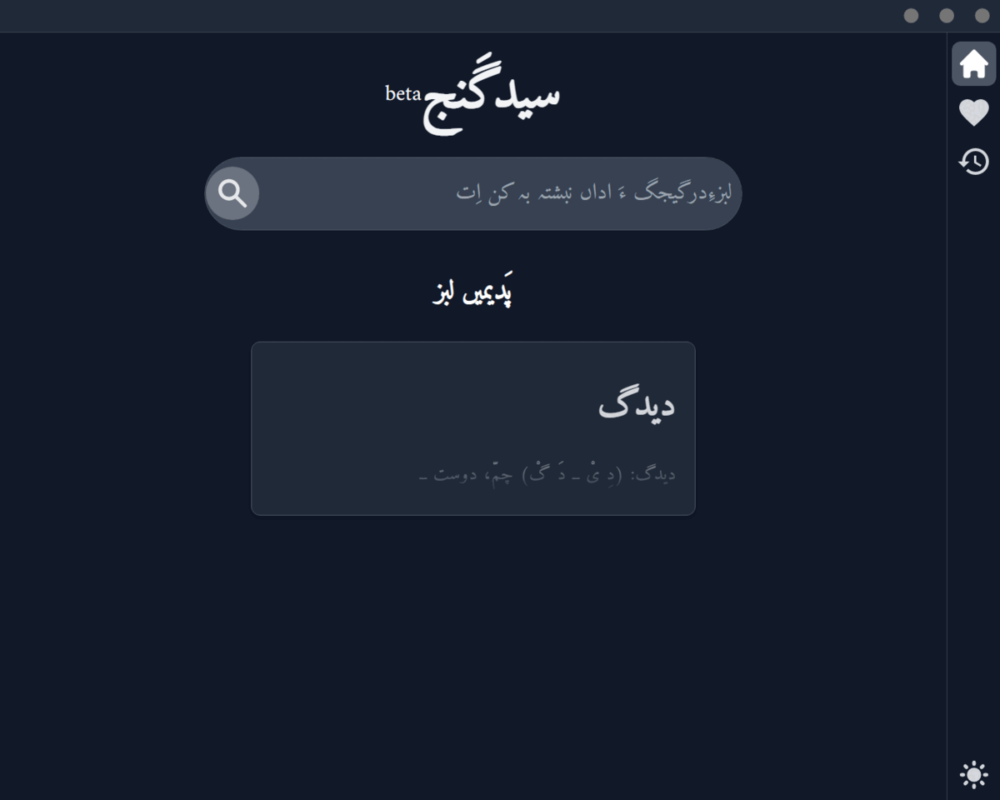

# Sayad Ganj - سیدگنج
The First Balochi Dictionary - بلوچی ءِ اوّلی بزانت بلد

A Desktop version of Sayad Ganj / سیدگنج built with ElectronJS + ReactJS + TailwindCSS

For the web version of Sayad Ganj, you can visit the [web repository](https://github.com/umairayub79/SayadGanj-Web).

To access the web version, you can visit the [live website](https://sayadganj.netlify.app).

## Screenshots





## Download
| File                           | Version | Size    | Release Date |
|--------------------------------|---------|---------|--------------|
| [Sayadganj-win32 Portable.zip](https://github.com/umairayub79/SayadGanj-Desktop/releases/download/v0.1.6/Sayadganj-v0.1.6-win32.zip)  | v0.1.6  | 131 MB  | Nov 12, 2022 |
| [Sayadganj-win64 Portable.zip](https://github.com/umairayub79/SayadGanj-Desktop/releases/download/v0.1.6/Sayadganj-v0.1.6-win64.zip)  | v0.1.6  | 136 MB  | Nov 12, 2022 |
| [Sayadganj-win32 Installer.exe](https://github.com/umairayub79/SayadGanj-Desktop/releases/download/v0.1.6/SayadganjSetup-v0.1.6-win32.exe) | v0.1.6  | 94.4 MB | Nov 12, 2022 |
| [Sayadganj-win64 Installer.exe](https://github.com/umairayub79/SayadGanj-Desktop/releases/download/v0.1.6/SayadganjSetup-v0.1.6-win64.exe) | v0.1.6  | 97.8 MB | Nov 12, 2022 |

# Development
## Run

```bash
  git clone https://github.com/umairayub79/SayadGanj-Desktop.git
  cd ./SayadGanj-Desktop
  npm install
  npm run electron:start
```
Runs the app in the development mode. A brand new window will be opened by electron automatically.

note: if you get a 'module not found' error that's because this project uses SQLite3 and SQLite3 is not a 'native' module so we need to rebuild it:

```bash
  npm run rebuild-sqlite3
```

If you are on a MacOSX, you might need to have XCode and its tools installed. Also, on Windows, you may need to have some of the .NET Framework properly installed to build that native module.

## Packaging for Production
To package the app for mac : 
```
npm run electron:package:mac
```
To package the app for windows : 
```
npm run electron:package:win
```
To package the app for linux : 
```
npm run electron:package:linux
```
## To-do

- [x] Random Word
- [x] Search
- [x] Search History
- [x] Copy to Clipboard
- [x] Restructure Database
- [x] Favorites
- [x] Dark Mode
- [x] Virtual Keyboard
- [x] Font Settings

## Contributing

Contributions are always welcome!


## Feedback

If you have any feedback, please reach out to me at umairayub79@gmail.com


## License

[MIT](https://choosealicense.com/licenses/mit/)
